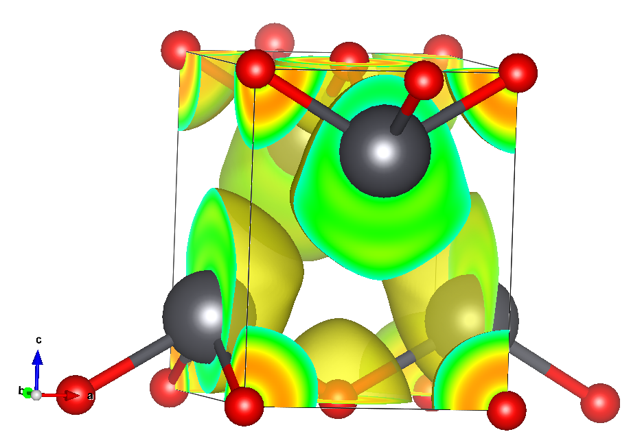

---
# Feel free to add content and custom Front Matter to this file.
# To modify the layout, see https://jekyllrb.com/docs/themes/#overriding-theme-defaults

# layout: home
title: Welcome
layout: default
rank: 1
---

## Welcome!

We are a laboratory at [Dalhousie University](https://www.dal.ca),
working at the intersection of chemistry, physics, and materials science.

We are particularly interested in how the chemical bonding in glass materials,
determines both its local structure and its optical response, especially
when the material is under various stress loads.

We use a combination of experiment and theory. Our main experimental approaches
include [solid state NMR](https://www.dal.ca/diff/nmr3.html) and optical measurements
based on acousto-optic diffraction. Our theoretical and modeling work is based
around Density Functional Theory, and we develop our ideas in the 
[Abinit code](https://www.abinit.org).
