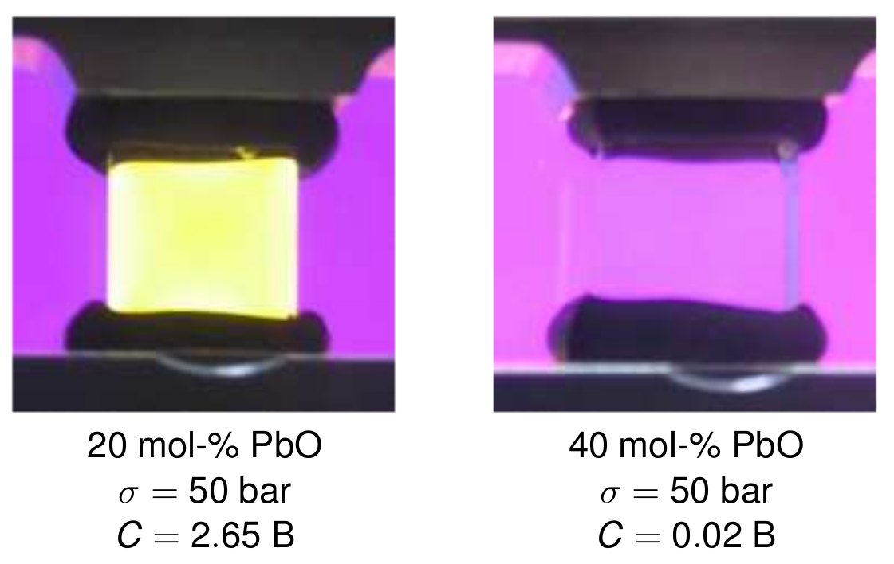
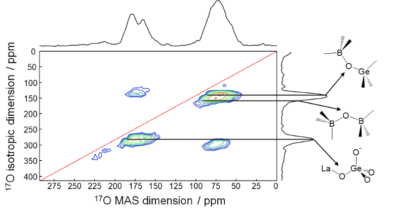
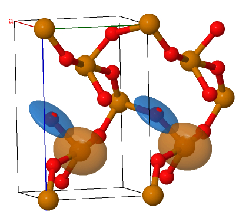

## Research themes

### Chemistry/Mechanics/Light Interaction in Glass

[We work intensively](https://doi.org/10.1016/j.jnoncrysol.2023.122580)
on the effect of chemistry on the optical and mechanical response
of glass. The left picture above shows a block of glass under stress, viewed through
crossed polarizers--the residual colour indicates that the glass has become birefringent.
The right picture shows the same set up but with glass enriched in lead oxide--the absence of
colour shows that the glass has *retained* its isotropic character, even in an *anisotropic*
environment.

### Structural Studies of Glass

We use various techniques, mainly
[solid state NMR](https://www.dal.ca/diff/nmr3.html), to investigate the
structure of glasses. The figure shows oxygen-17 NMR, which 
[we used to study](https://doi.org/10.1021/acs.jpcc.9b02430)
glass ceramics based on LaBGeO5.

### Theory and Modelling

We develop theory and code to compute observables we measure in the
lab, particularly for NMR. The picture above shows the chemical shielding
tensor (brown, on tellurium) and electric field gradient tensor (blue, 
on oxygen) in TeO2, computed with implementations 
[we have made](https://doi.org/10.1103/PhysRevB.107.165157)
in the [Abinit code](https://www.abinit.org).
